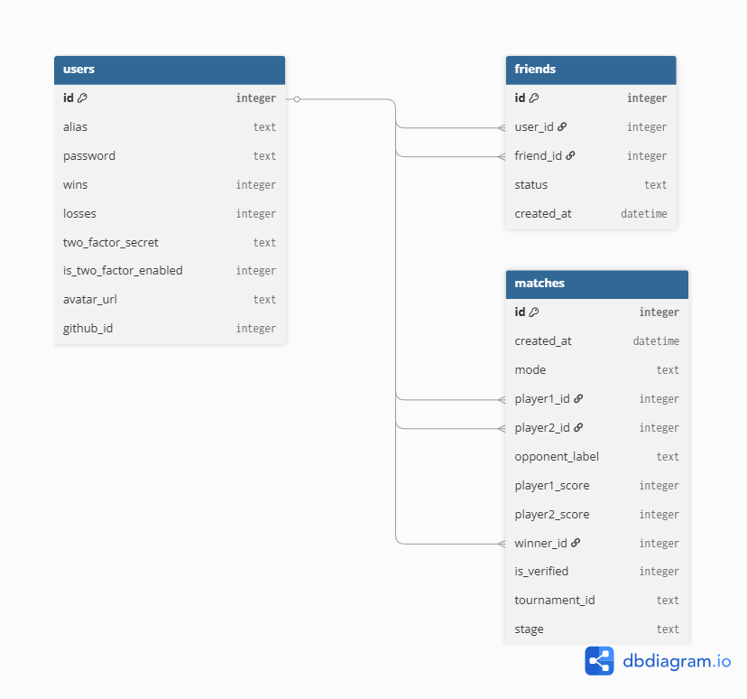

*This project has been created as part of the 42 curriculum by itulgar, ahyildir, ahmsanli*

### Description

**Project Name:** ft_transcendence

This project is a modern web application designed to recreate the classic "Pong" game (1972) with a comprehensive set of features, transforming it into a full multiplayer and social experience. The primary goal is to create a Single Page Application (SPA) that allows users to play Pong, compete in tournaments, manage their profiles, and interact with each other.

**Key Features:**

*   **Classic Pong Gameplay:** Play the original game in a 1v1 local multiplayer mode.
*   **Advanced Pong Gameplay:** Play the modified version of the pong game.
*   **Online Multiplayer:** Challenge other players to 1v1 matches in real-time via WebSockets.
*   **Tournament System:** Create and participate in tournaments with a dynamic bracket and automated matchmaking.
*   **Secure Authentication:** A robust user system featuring registration, login, JWT-based sessions, and Two-Factor Authentication (TOTP).
*   **Remote Authentication:** Log in or sign up using your GitHub account via OAuth 2.0.
*   **Live Chat:** Communicate with other users through direct messages, block users, and send game invites directly from the chat interface.
*   **User Profiles:** Customize your profile with an alias and avatar, view your game statistics (wins/losses), and review your match history.
*   **AI Opponent:** Practice against an AI with multiple difficulty levels.
*   **Internationalization:** The application interface is available in multiple languages (English, Turkish, French).

### Instructions

This section provides a step-by-step guide to get the project running on your local machine.

**Prerequisites:**

*   **Docker and Docker Compose:** The entire project is containerized, so you must have Docker installed and running.
*   **A `.env` file:** You will need to create a `.env` file to store your environment variables, such as API keys and secrets.

**Step-by-Step Instructions:**

1.  **Set up Environment Variables:**
    *   Navigate to the `Merged/tr-merged` directory.
    *   You will find a file named `.env.example`. Create a copy of this file and name it `.env`.
    *   Open the newly created `.env` file and fill in the required values. At a minimum, you must configure the following:
        *   `JWT_SECRET`: A long, random, and secret string used for signing authentication tokens.
        *   `COOKIE_SECRETT`: A long, random, and secret string used for signing cookies.
        *   `GITHUB_CLIENT_ID`: Your GitHub OAuth Application's Client ID.
        *   `GITHUB_CLIENT_SECRET`: Your GitHub OAuth Application's Client Secret.

2.  **Build and Run the Project:**
    *   With Docker running, execute the following command from the `Merged/tr-merged` directory:
        ```bash
        docker-compose up --build
        ```
    *   This command will build the Docker images for the backend, frontend, and Nginx services, and then start them. Wait for the process to complete.

3.  **Access the Application:**
    *   Open your web browser and navigate to `https://localhost`.
    *   **Important:** The project uses a self-signed SSL certificate to enable HTTPS. Your browser will show a security warning. You must accept this warning to proceed and access the site.

### Resources

**Classic References:**

*   **Pong (1972):** The core gameplay is based on the original arcade classic.
*   **Node.js & Fastify Documentation:** Used for building the high-performance backend.
*   **TypeScript & Vite Documentation:** Used for the modern, type-safe frontend development.
*   **Docker Documentation:** For understanding the containerization and service orchestration.
*   **SQLite Documentation:** For information on the database engine.
*   **JSON Web Tokens (JWT):** For the stateless authentication mechanism.
*   **Time-based One-Time Password (TOTP):** For the 2FA implementation.

**Use of AI in Development**

AI-powered assistants like Gemini were utilized throughout the development process as a productivity-enhancing tool. The goal was to streamline development, accelerate problem-solving, and improve code quality, rather than having the AI write the entire project.

Here’s a breakdown of how AI assistance was leveraged:

*   **Boilerplate Code and Configuration:**
    *   **Dockerfile:** AI was used to generate the initial `Dockerfile` for the Node.js backend, including commands for installing dependencies like `python3`, `make`, and `g++` which are necessary for native modules like `sqlite3`.
    *   **Nginx Configuration:** AI helped create the initial `nginx.conf` file, providing a template for setting up the reverse proxy, handling WebSocket connections (`/ws`), and routing API requests (`/api/`) to the backend service.

*   **Problem Solving and Debugging:**
    *   When encountering specific bugs or complex issues (e.g., WebSocket connection errors, JWT validation logic), AI was consulted to provide potential solutions, explain error messages, and suggest debugging strategies.

*   **Code Snippets and Logic:**
    *   AI was prompted to generate specific, isolated code snippets. For example, creating a robust `escapeHtml()` function to prevent XSS vulnerabilities or providing the logic for the ball's bounce physics in the Pong game.

*   **Learning and Conceptual Understanding:**
    *   The AI served as an interactive knowledge base for clarifying complex topics such as the OAuth 2.0 authorization flow, the specifics of TOTP-based 2FA, and best practices for securing a web application against common threats.

*   **Code Review and Refactoring:**
    *   Code blocks were occasionally submitted to the AI for a "second opinion" on code quality, security, and performance. For instance, it helped identify potential XSS vulnerabilities in the initial implementation where `innerHTML` was used, leading to the adoption of safer alternatives like `textContent` or the use of an escaping function.

The final implementation and integration of all components were handled by the developers, ensuring the code met the project's specific requirements and quality standards. The AI acted as a collaborator and a powerful research tool.

### Team Information

This project was developed by a team of three members who collaborated on all major decisions in a flat organizational structure. While there were no formal hierarchical roles like a single Product Owner or Project Manager, responsibilities were distributed based on technical domains.

*   **Ahmet Hakan YILDIRIM (ahyildir)**
    *   **Role:** Backend & DevOps Lead Developer
    *   **Responsibilities:** Responsible for designing and developing the entire backend architecture using Node.js and Fastify. Managed the database schema, implemented the user authentication systems (JWT, 2FA, OAuth), and developed all API endpoints. Also handled the project's containerization with Docker and the Nginx reverse proxy configuration.

*   **Ahmet SANLI (ahmsanli)**
    *   **Role:** Gameplay & WebSocket Lead Developer
    *   **Responsibilities:** Focused on the core gameplay experience. Developed the Pong game logic, including the physics, real-time multiplayer functionality using WebSockets, and the tournament system. Also implemented the live chat feature and the AI opponent.

*   **Ilknur TULGAR (itulgar)**
    *   **Role:** Frontend Lead Developer
    *   **Responsibilities:** Led the development of the user interface and user experience. Built the single-page application (SPA) using TypeScript and Vite, managed the application's routing, and was responsible for the overall visual design and responsiveness. Integrated the frontend with the backend API.

### Project Management

The team adopted a flexible and direct approach to project management, emphasizing clear communication and a well-defined distribution of work.

*   **Work Organization:** Tasks were distributed among the team members based on their primary area of responsibility: backend, frontend, and gameplay/WebSocket. Regular in-person meetings were held at the 42 Istanbul campus to synchronize progress, discuss architectural decisions, resolve challenges, and plan upcoming work.

*   **Management & Version Control Tools:** **GitHub** was the central tool for managing the project's codebase. It was used for version control, branching, and merging the different parts of the application as they were developed.

*   **Communication Channels:** **WhatsApp** was used as the primary communication channel for daily coordination, quick questions, and sharing status updates, allowing for a constant and fluid flow of information between team members.

### Technical Stack

This section outlines the technologies chosen for the project and the rationale behind these decisions.

*   **Frontend:**
    *   **Technologies:** **TypeScript**, **Vite**, and **Tailwind CSS**.
    *   **Justification:** **TypeScript** was chosen to bring type safety to JavaScript, reducing bugs and improving code maintainability. **Vite** was selected as the build tool for its extremely fast development server and optimized build process. **Tailwind CSS**, a utility-first CSS framework, was used to rapidly build a custom and responsive user interface without writing extensive custom CSS.

*   **Backend:**
    *   **Technologies:** **Node.js** with the **Fastify** framework.
    *   **Justification:** **Node.js** was a natural choice for its asynchronous, event-driven architecture, which is ideal for real-time applications involving WebSockets. **Fastify** was chosen over other frameworks like Express for its focus on high performance and low overhead, ensuring the backend could handle many concurrent connections efficiently.

*   **Database:**
    *   **Technology:** **SQLite3**.
    *   **Justification:** SQLite was selected for its simplicity and self-contained nature. As a serverless, file-based database, it eliminated the need for a separate database container, simplifying the Docker setup. It is lightweight and provides all the necessary relational database features for this project's scale without the complexity of a larger database management system like PostgreSQL or MySQL.

*   **Other Significant Technologies:**
    *   **Docker & Docker Compose:** Used to containerize the entire application (frontend, backend, proxy). This ensures a consistent and reproducible environment for both development and deployment.
    *   **Nginx:** Employed as a high-performance reverse proxy. It routes client requests to the appropriate service (frontend or backend), handles SSL termination for HTTPS, and efficiently serves the static frontend assets.
    *   **WebSockets (`@fastify/websocket`):** The core technology for all real-time features, including live multiplayer gameplay and the chat system, enabling low-latency, bidirectional communication between the client and server.
    *   **JSON Web Tokens (JWT):** Implemented for stateless user authentication, allowing for a secure and scalable way to manage user sessions across the distributed services.

### Database Schema



The project uses a relational database structure with three main tables to manage users, their relationships, and their game history.

**1. `users` Table**

This is the central table for storing all user account information.

*   **`id`**: `INTEGER` - Primary Key, auto-incrementing.
*   **`alias`**: `TEXT` - The user's unique display name.
*   **`password`**: `TEXT` - The user's hashed password.
*   **`wins`**: `INTEGER` - The total number of games won (defaults to 0).
*   **`losses`**: `INTEGER` - The total number of games lost (defaults to 0).
*   **`two_factor_secret`**: `TEXT` - The secret key for 2FA, stored only when 2FA is being set up.
*   **`is_two_factor_enabled`**: `INTEGER` - A boolean flag (0 or 1) indicating if 2FA is active (defaults to 0).
*   **`avatar_url`**: `TEXT` - The path or URL to the user's avatar image (defaults to a standard avatar).
*   **`github_id`**: `INTEGER` - The user's unique ID from GitHub, used for OAuth.

**2. `friends` Table**

This table manages the social relationships between users.

*   **`id`**: `INTEGER` - Primary Key, auto-incrementing.
*   **`user_id`**: `INTEGER` - A foreign key referencing the `id` of the user who initiated the friend request.
*   **`friend_id`**: `INTEGER` - A foreign key referencing the `id` of the user who received the request.
*   **`status`**: `TEXT` - The current status of the friendship (e.g., "pending", "accepted").
*   **`created_at`**: `DATETIME` - The timestamp when the relationship was created.
*   **Relationships:** This table has a many-to-many relationship with the `users` table, linking two users together. A unique constraint on (`user_id`, `friend_id`) prevents duplicate entries.

**3. `matches` Table**

This table serves as a log for every game played.

*   **`id`**: `INTEGER` - Primary Key, auto-incrementing.
*   **`created_at`**: `DATETIME` - The timestamp when the match was played.
*   **`mode`**: `TEXT` - The game mode (e.g., "1v1", "tournament").
*   **`player1_id`**: `INTEGER` - A foreign key referencing the `id` of the first player.
*   **`player2_id`**: `INTEGER` - A foreign key referencing the `id` of the second player (can be `NULL` if playing against a non-registered opponent like an AI).
*   **`opponent_label`**: `TEXT` - A display name for an opponent who is not a registered user (e.g., "AI" or a guest's alias).
*   **`player1_score`**: `INTEGER` - The final score of player 1.
*   **`player2_score`**: `INTEGER` - The final score of player 2.
*   **`winner_id`**: `INTEGER` - A foreign key referencing the `id` of the winning user.
*   **`is_verified`**: `INTEGER` - A boolean flag (0 or 1) to confirm the match results have been validated (defaults to 0).
*   **`tournament_id`**: `TEXT` - An identifier to group matches belonging to the same tournament.
*   **`stage`**: `TEXT` - The stage of the tournament in which the match was played (e.g., "Quarter-final", "Final").
*   **Relationships:** This table is linked to the `users` table via the `player1_id`, `player2_id`, and `winner_id` fields.

### Features List

This section details the implemented features and the primary team members responsible for their development.

*   **User Authentication System**
    *   **Description:** Provides secure user registration and login functionality using JWTs stored in httpOnly cookies. Passwords are encrypted for security.
    *   **Members:** ahyildir (Backend Logic), itulgar (Frontend Integration).

*   **Two-Factor Authentication (2FA)**
    *   **Description:** Users can enhance their account security by enabling Time-based One-Time Password (TOTP) authentication.
    *   **Members:** ahyildir (Backend Logic), itulgar (Frontend UI/UX).

*   **OAuth 2.0 with GitHub**
    *   **Description:** Allows users to sign up or log in seamlessly using their existing GitHub accounts.
    *   **Members:** ahyildir (Backend Logic), itulgar (Frontend Integration).

*   **User Profile & Dashboard**
    *   **Description:** Users can customize their public profile by changing their alias and uploading an avatar. The dashboard displays their game statistics (wins/losses) and a complete history of their past matches.
    *   **Members:** ahyildir (Backend API), itulgar (Frontend UI).

*   **Live Chat & Social System**
    *   **Description:** A real-time chat system allows for direct messaging between users. The social system includes the ability to add/remove friends, block/unblock users, and see their online status.
    *   **Members:** ahmsanli (Real-time WebSocket Logic), ahyildir (Friendship/Block API), itulgar (Chat UI).

*   **Classic Pong (Local 1v1 & vs. AI)**
    *   **Description:** The core Pong gameplay. Users can play in a local 1v1 mode against a friend on the same computer or practice against a computer-controlled AI with multiple difficulty levels.
    *   **Members:** ahmsanli (Game Logic, AI, Game UI).

*   **Online Multiplayer (1v1)**
    *   **Description:** A real-time gameplay mode where users can challenge each other to live 1v1 matches in local.
    *   **Members:** ahmsanli (WebSocket & Game State Logic, Matchmaking).

*   **Tournament Mode**
    *   **Description:** Users can create and join multi-player tournaments. The system automatically generates a bracket, manages matchmaking between rounds, and declares a final winner.
    *   **Members:** ahmsanli (Tournament Logic & WebSockets).

*   **Internationalization (i18n)**
    *   **Description:** The frontend interface is fully translatable and supports multiple languages (English, Turkish, and French).
    *   **Members:** itulgar (Frontend Implementation).

*   **Containerized Deployment**
    *   **Description:** The entire application (backend, frontend, proxy) is containerized using Docker and orchestrated with Docker Compose, including an Nginx reverse proxy for routing and SSL termination.
    *   **Members:** ahyildir (Docker & Nginx Configuration).

### Modules

This section provides details on the chosen modules for the project, their point values, justification, and implementation.

*   **Backend Framework (Major - 2pts)**
    *   **Module:** Use Node.js with the Fastify framework.
    *   **Justification:** Fastify was chosen for its high-performance, low-overhead architecture, making it ideal for a real-time application with numerous WebSocket connections for gameplay and chat. Node.js's asynchronous model is a perfect fit for this.
    *   **Implementation:** The entire backend was built as a monolith using Fastify. It handles all API routing, request validation, database communication, and serves as the WebSocket server.
    *   **Members:** ahyildir

*   **Frontend Framework (Minor - 1pt)**
    *   **Module:** Use TypeScript and Tailwind CSS.
    *   **Justification:** TypeScript was selected to enforce type safety, which significantly reduces runtime errors and improves code maintainability. Tailwind CSS was used for its utility-first approach, enabling the rapid development of a custom and fully responsive design.
    *   **Implementation:** The frontend is a Single Page Application (SPA) built with Vite. All components and logic are written in TypeScript, and styling is handled exclusively with Tailwind CSS utility classes.
    *   **Members:** itulgar

*   **Database (Minor - 1pt)**
    *   **Module:** Use SQLite for the database.
    *   **Justification:** SQLite was the ideal choice for its simplicity and serverless, file-based nature. This eliminated the need for a separate database container, simplifying the overall Docker configuration and project setup.
    *   **Implementation:** The backend uses the `sqlite3` Node.js package to create and interact with a local database file. The database schema and all queries are managed within the backend service.
    *   **Members:** ahyildir

*   **Standard User Management (Major - 2pts)**
    *   **Module:** Comprehensive user management system.
    *   **Justification:** This module is the foundation of the application, enabling persistent identities, social features, and personalized statistics, which are critical for a multiplayer game.
    *   **Implementation:** Secure backend endpoints were created for registration, login, profile updates (alias, avatar), and friend management (add/view status). The frontend provides all the necessary UI components for these interactions. User stats and match history are fetched from the database and displayed on their profile page.
    *   **Members:** ahyildir (Backend), itulgar (Frontend)

*   **Remote Authentication (Major - 2pts)**
    *   **Module:** Implement OAuth 2.0 with GitHub.
    *   **Justification:** Integrating a trusted third-party authentication provider like GitHub offers users a secure, convenient, and familiar way to log in without needing to create a separate password, which improves the user experience.
    *   **Implementation:** The backend handles the complete OAuth 2.0 authorization code flow. It redirects the user to GitHub, handles the callback, exchanges the code for an access token, fetches the user's profile, and creates a local session. The frontend provides the "Login with GitHub" button.
    *   **Members:** ahyildir (Backend), itulgar (Frontend)

*   **Multiple Players (Tournament Mode) (Major - 2pts)**
    *   **Module:** A game mode involving more than two players.
    *   **Justification:** This module was interpreted as a tournament system, which provides a competitive structure for a group of players to compete against each other, dramatically increasing user engagement and replayability.
    *   **Implementation:** A tournament system was implemented where users can join a waiting list. Once enough players have joined, the backend creates a bracket and manages the series of 1v1 matches. WebSockets are used to notify users of their upcoming matches and to update the tournament bracket in real-time. 
    *   **Members:** ahmsanli (Tournament Logic,  Tournament API, UI)

*   **AI Opponent (Major - 2pts)**
    *   **Module:** Introduce an AI opponent.
    *   **Justification:** An AI opponent is crucial for providing a single-player experience, allowing users to practice and enjoy the game at any time, regardless of whether other players are online.
    *   **Implementation:** The AI logic resides on the server. It functions by predicting the ball's trajectory. To simulate human-like constraints and prevent it from being unbeatable, the AI's view of the game state is intentionally limited, forcing it to anticipate bounces rather than reacting with perfect information. Different difficulty levels were implemented by adjusting the AI's speed and reaction time.
    *   **Members:** ahmsanli

*   **Live Chat (Major - 2pts)**
    *   **Module:** Implement a full-featured live chat.
    *   **Justification:** The chat is the social hub of the application, enabling direct communication, community building, and seamless organization of games.
    *   **Implementation:** The chat is powered by WebSockets for real-time messaging. The backend manages message delivery and user connections. The frontend provides a complete UI allowing users to send DMs, view profiles, block other users, and invite them to a game directly from the chat window.
    *   **Members:** ahmsanli (WebSocket Logic).

*   **2FA and JWT (Major - 2pts)**
    *   **Module:** Implement Two-Factor Authentication and JSON Web Tokens.
    *   **Justification:** JWT was chosen as a modern, stateless authentication standard for SPAs. 2FA (using TOTP) was implemented to provide an essential layer of security, protecting user accounts from unauthorized access.
    *   **Implementation:** The backend issues a JWT upon successful login, which is stored in a secure, httpOnly cookie. For 2FA, the backend generates a TOTP secret that the user scans with an authenticator app. The backend then verifies the time-based code during the login process.
    *   **Members:** ahyildir (Backend), itulgar (Frontend)

*   **Game Customization (Minor - 1pt)**
    *   **Module:** Provide game customization options.
    *   **Justification:** This module was interpreted as offering different opponent choices to customize the gameplay experience and difficulty.
    *   **Implementation:** Before a match starts, the user interface allows the player to choose their opponent: another local player or an AI. If AI is selected, the user can then choose from multiple difficulty levels, which adjusts the AI's behavior.
    *   **Members:** ahmsanli (AI Logic).

*   **Multi-language Support (Minor - 1pt)**
    *   **Module:** Support for at least three languages.
    *   **Justification:** Supporting multiple languages (English, Turkish, and French) makes the application more accessible and welcoming to a diverse, international audience.
    *   **Implementation:** An i18n library was integrated into the frontend. All user-facing strings are stored in separate JSON files for each language. A language switcher component allows users to dynamically change the displayed language, which is then saved as their preference.
    *   **Members:** itulgar

*   **Responsive Design (Minor - 1pt)**
    *   **Module:** Support on all devices.
    *   **Justification:** A responsive design is essential for modern web applications to provide a consistent and usable experience across desktops, tablets, and mobile phones.
    *   **Implementation:** The entire frontend was built using a mobile-first approach with Tailwind CSS. Responsive breakpoints and flexible layouts (Flexbox/Grid) were used extensively to ensure all components and views adapt correctly to any screen size.
    *   **Members:** itulgar

### Individual Contributions

This section provides a detailed breakdown of each team member's primary contributions to the project, the features they implemented, and the challenges they overcame.

**Ahmet Hakan YILDIRIM (ahyildir)**

As the Backend and DevOps Lead, ahyildir was responsible for the entire server-side architecture and infrastructure of the project.

*   **Specific Contributions:**
    *   **Backend Architecture:** Designed and built the entire backend using Node.js and the Fastify framework, creating a high-performance, monolithic service to handle all application logic.
    *   **Database Management:** Designed the SQLite database schema and implemented all database logic for users, friends, and matches.
    *   **Authentication Systems:** Implemented all three major authentication modules: standard user registration with JWT, secure Two-Factor Authentication (TOTP), and remote authentication via the GitHub OAuth 2.0 flow.
    *   **API Development:** Created all RESTful API endpoints required by the frontend for user management, profiles, friend/block system, chat history, and tournament management.
    *   **DevOps & Containerization:** Wrote the `Dockerfile` for the backend and the main `docker-compose.yml` file to orchestrate all services. Configured the Nginx reverse proxy to correctly route API traffic, WebSocket connections, and serve the frontend application, including handling SSL termination.
*   **Challenges Faced:**
    *   The most significant challenge was configuring Nginx and Docker to work in harmony. Ensuring that stateless API requests, stateful WebSocket connections, and the frontend's single-page application routing all functioned correctly behind a single entry point required complex proxy rules and a deep understanding of the network flow.

**Ahmet ŞANLI (ahmsanli)**

As the Gameplay and WebSocket Lead, ahmsanli focused on the core real-time and interactive elements of the application.

*   **Specific Contributions:**
    *   **Game Logic:** Developed the core physics and logic for the Pong game, including ball movement, paddle controls, and scorekeeping.
    *   **Real-Time Multiplayer:** Engineered the WebSocket-based communication for synchronizing game state between two clients for live 1v1 matches.
    *   **Tournament System:** Designed and implemented the backend logic for the tournament mode, including bracket generation, automated matchmaking between rounds, and real-time updates.
    *   **AI Opponent:** Created the AI opponent, implementing logic that predicts ball movement with simulated human constraints (limited refresh rate) to provide a fair but challenging experience across multiple difficulty levels.
    *   **Live Chat Core:** Built the WebSocket foundation for the live chat, managing user connections and the real-time broadcasting of messages.
*   **Challenges Faced:**
    *   The primary challenge was managing the real-time game state synchronization over WebSockets with minimal latency to ensure a smooth and fair gameplay experience for multiplayer. Designing the tournament state machine to reliably handle user disconnections and advance the bracket correctly was also a complex task.

**İlknur TULGAR (itulgar)**

As the Frontend Lead, itulgar was responsible for the entire user-facing experience, from visual design to client-side logic and API integration.

*   **Specific Contributions:**
    *   **Frontend Architecture:** Built the entire Single Page Application (SPA) from the ground up using TypeScript and the Vite build tool.
    *   **UI/UX Design & Implementation:** Designed and implemented the entire user interface for all features, including authentication forms, user dashboards, the chat system, game interface, and the dynamic tournament bracket view.
    *   **Responsiveness & Styling:** Used Tailwind CSS to create a fully responsive, mobile-first design, ensuring the application is usable and looks great on all devices, from desktops to smartphones.
    *   **API Integration:** Connected the frontend to all backend APIs, managing state, and handling data fetching and submission for every feature.
    *   **Internationalization (i18n):** Implemented the multi-language support module, setting up the structure for translations and allowing users to switch between English, Turkish, and French.
*   **Challenges Faced:**
    *   The main challenge was managing complex client-side state, especially with multiple real-time features (chat, game, notifications) potentially operating at the same time. Ensuring the UI always reflected the true state of the application without bugs or race conditions required careful and structured code.


